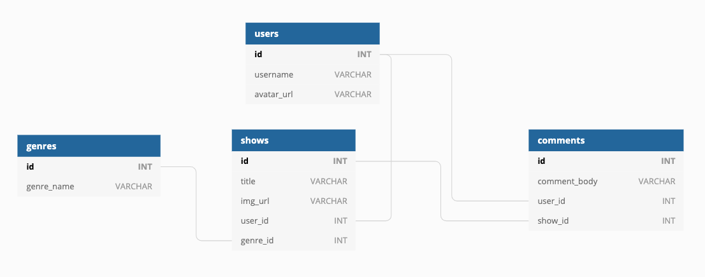

# TV Show WatchList

## [Live demo](https://tv-show-watchlist.herokuapp.com/)

TV Show WatchList is a full-stack application where users can post and comment on TV shows that they are binging on.
The app is designed to helps people decide what to watch next, mostly by reading comments on a selected show or just by referring to how many users have watched it.

- Users can create their account and login to their account using a username and a password.
- Users are be able to **add shows** that they watch. These shows are shared on their profile pages.
- Users can view the profile pages of other users.
- Users are able to **add comments** on other users' shows.
 
 
## Run App locally
After cloning the repo, please run the following commands:
- **npm run init_db** : Will create the database and seed it with some mock data
- **npm run init_app** : Will install the install the dependencies and generates the build folder
- **npm start** : Will open http://localhost:3131 and run the server
 
 
## Database Structure

- **Users**
  - id
  - username - _Unique_
  - avatar_url 

- **Genres**
  - id
  - genre_name - _Unique_

- **Shows**
  - id
  - title
  - img_url
  - user_id - _References Users_
  - genre_id - _References Genres_

- **Comments**
  - id
  - comment_body
  - user_id - _References Users_
  - show_id - _References Shows_

> You may use the included [seed.sql](/seed.sql) file.

## API Endpoints

Your API Endpoints should include at least:

- **Users**

  | Method | Endpoint     | Description           | Body Data                |
  | ------ | ------------ | --------------------- | ------------------------ |
  | GET    | `/users`     | Get all users         | n/a                      |
  | GET    | `/users/:id` | Get single user by id | n/a                      |
  | POST   | `/users/`    | Add new user          | `avatar_url`, `username` |

- **Genres**

  | Method | Endpoint  | Description    | Body Data    |
  | ------ | --------- | -------------- | ------------ |
  | GET    | `/genres` | Get all genres | n/a          |
  | POST   | `/genres` | Add new genre  | `genre_name` |

- **Shows**

  | Method | Endpoint                 | Description                         | Body Data                                 |
  | ------ | ------------------------ | ----------------------------------- | ----------------------------------------- |
  | GET    | `/shows`                 | Get all shows                       | n/a                                       |
  | GET    | `/shows/:id`             | Get single show by id               | n/a                                       |
  | POST   | `/shows`                 | Add new show                        | `title`, `img_url`, `user_id`, `genre_id` |
  | GET    | `/shows/genre/:genre_id` | Get all shows for specific genre_id | n/a                                       |
  | GET    | `/shows/user/:user_id`   | Get all shows for specific user_id  | n/a                                       |

- **Comments**

  | Method | Endpoint                  | Description                           | Body Data                            |
  | ------ | ------------------------- | ------------------------------------- | ------------------------------------ |
  | GET    | `/comments/show/:show_id` | Get all comments for specific show_id | n/a                                  |
  | POST   | `/comments`               | Add new comment                       | `comment_body`, `user_id`, `show_id` |
